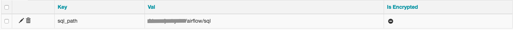
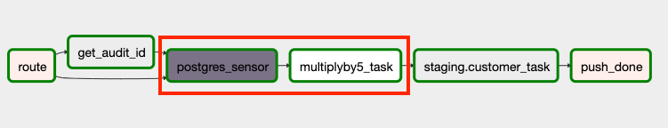

# Airflow

Airflow是一個開源工作流管理平台(schedule workflow)，相較於其它ETL tools(e.g. Nifi, datastage, informatica, SSIS)，airflow並不負責處理資料(data flow)，airflow利用DAG來代表工作流程(workflow)，提供Web UI顯示有什麼工作、執行時間週期、工作之間的執行順序以及依賴關係。

## Quick start

    1.airflow needs a home, ~/airflow is the default
    (optional)
    $ export AIRFLOW_HOME=~/airflow
    
    2.install from pypi using pip
    $ pip install apache-airflow
    
    3.initialize the database
    $ airflow initdb
	
	4.start the scheduler
    $ airflow scheduler
	
	5.start the web server, default port is 8080
    $ airflow webserver -p 8080

 - metadata db - sqlite
 - executor - SequentialExecutor
>   建議：executor換成**LocalExecutor**，metadata db換成**MySQL**或**Postgres** 

>   1. 修改airflow.cfg中executor 

    #The executor class that airflow should use. Choices include
    #SequentialExecutor, LocalExecutor, CeleryExecutor, DaskExecutor, KubernetesExecutor
    executor = LocalExecutor

>   2. 修改airflow.cfg，metadata database指向Postgres

    # The SqlAlchemy connection string to the metadata database.
    # SqlAlchemy supports many different database engine, more information
    # their website
    sql_alchemy_conn = postgresql+psycopg2://localhost/airflow

>   3.  open a PostgreSQL Shell

    psql

>   4.  create a new database

    CREATE DATABASE airflow

>   5.  初始化airflow

    airflow initdb

## DAG

**DAG - 有向無環圖（Directed Acyclic Graph）**

DAG 說明有什麼工作、執行時間週期、工作之間的執行順序以及依賴關係。 
DAG 最終目標將所有工作在對的時間依照上下游關係全部執行。

## Task

## Operator

## Hook

## Sensor

## plugins

## 共用參數
[airflow加入相關參數]  
https://github.com/chuhaoyuu/airflow/blob/master/dags/init_example.py

-   連線
>   .postgresql.ini 
    
        [postgres_dwh]
        host=localhost
        port=5432
        dbname=dwh
        user=`user`
        password=`password`

        [postgres_orders]
        host=localhost
        port=5432
        dbname=orders
        user=`user`
        password=`password`

-   參數(PATH, etc.)

## 動態 DAG、Task
>   **前端有10個table要備份資料至倉儲，某天需求多增加100個table** 
    ~~新增100個DAG或100個task~~

-   **動態task** 
[Creating a dynamic DAG using Apache Airflow]  https://towardsdatascience.com/creating-a-dynamic-dag-using-apache-airflow-a7a6f3c434f3  
[CREATE DYNAMIC WORKFLOW IN APACHE AIRFLOW]  https://www.data-essential.com/create-dynamic-workflow-in-apache-airflow/

        tables = ['a','b','c','d','e','f','g']

        def dynamicTask(table, **context):
            return DummyOperator(task_id="{0}".format(table),dag=dag)
        
        for table in tables:
            task1 >> dynamicTask(table) >> task3

    

-   **動態DAG** 
[Dynamically Generating DAGs in Airflow]  https://www.astronomer.io/guides/dynamically-generating-dags/

## xcom_push、xcom_pull
>   **DAG task之間value交換(subdag task, different DAGs, etc.)**

-   **xcom讓task之間資訊交換, cross-communication的簡寫**

-   **task之間資訊交換**

        value = context['task_instance'].xcom_pull(task_ids='task1')

-   **subdag task之間資訊交換**

        value = context['task_instance'].xcom_pull(dag_id='sub_dag.xcom_subdag', task_ids='task1')

-   **DAG之間資訊交換** 

    [Read&Write Xcom in different DAG]  
    https://medium.com/analytics-vidhya/airflow-xcom-pull-and-push-under-the-hood-multiple-value-from-different-dags-and-etc-2b9b3a942299

        from airflow.models import XCom
        
        get_xcom = XCom.get_many(
            execution_date=make_aware(datetime(2020, 2, 13, 8, 00, 00)),
            dag_ids=["write_to_xcom"], 
            include_prior_dates=True
            )

        value = context['task_instance'].xcom_pull(dag_id="write_to_xcom", key='test_dag_2', include_prior_dates=True)
        
        print(get_xcom)
        print(value)

        #   dag_ids : 不同(含本身)DAG的資訊
        #   include_prior_dates = True : Airflow找出小於execution date的所有相關紀錄,
            如task instance有多筆紀錄且key一樣則會抓到最後一筆記錄

>   [<XCom "test_dag_3" (xcom_push_task @ 2020-02-13 06:45:20.531321+00:00)> ,<XCom "test_dag_2" (xcom_push_task @ 2020-02-13 06:44:48.776438+00:00)> ,<XCom "test_dag_1" (xcom_push_task @ 2020-02-13 06:44:19.436805+00:00)> ,<XCom "test_dag_3" (xcom_push_task @ 2020-02-13 00:00:00+00:00)>] 
    {'key123': 'value345'}

 

>   **利用xcom_pull做出sensor效果** 
    -**DAG_B需要等DAG_A完成後才可以執行**

**A (DAG)** 
 
**B (DAG)** 
 

## SubDAG
[SubDAGs] 
https://airflow.apache.org/docs/stable/concepts.html?#subdags

## DAG模組化 ??
>   **利用SubDAG共用DAG** 
    -**任何DAG啟動前都必須檢查各式各樣的前置作業是否完成，將繁瑣前置作業包成DAG讓其它DAG import使用**

**precheck**

    import airflow
    from airflow.operators.python_operator import PythonOperator
    from airflow.operators.dummy_operator import DummyOperator

    class precheckDAG(object):

        def check(self,**context):
            return 'DONE'

        def precheck(self,parent_dag_name, child_dag_name, start_date, schedule_interval):
            dag = airflow.DAG(
                '%s.%s' % (parent_dag_name, child_dag_name),
                schedule_interval=schedule_interval,
                start_date=start_date,
            )

            task1 = DummyOperator(
                task_id='checktask1', 
                dag=dag
                )

            task2 = PythonOperator(
                task_id='checktask2', 
                python_callable=self.check, 
                dag=dag
                )        
            task1 >> task2

            return dag

**main (DAG)**

    from PrecheckDAG import precheckDAG

    precheck = precheckDAG()
    check = SubDagOperator(
        subdag = precheck.precheck('sub_dag', 'precheck_dag', date, interval),
        task_id='precheck_dag',
        dag=dag,
    )

    check >> task1 >> task3
    

## unittest
-  **模擬airflow scheduler執行DAG**
[https://github.com/chuhaoyuu/airflow/blob/master/tests/test_airflow.py]
>   測試其中兩個task

